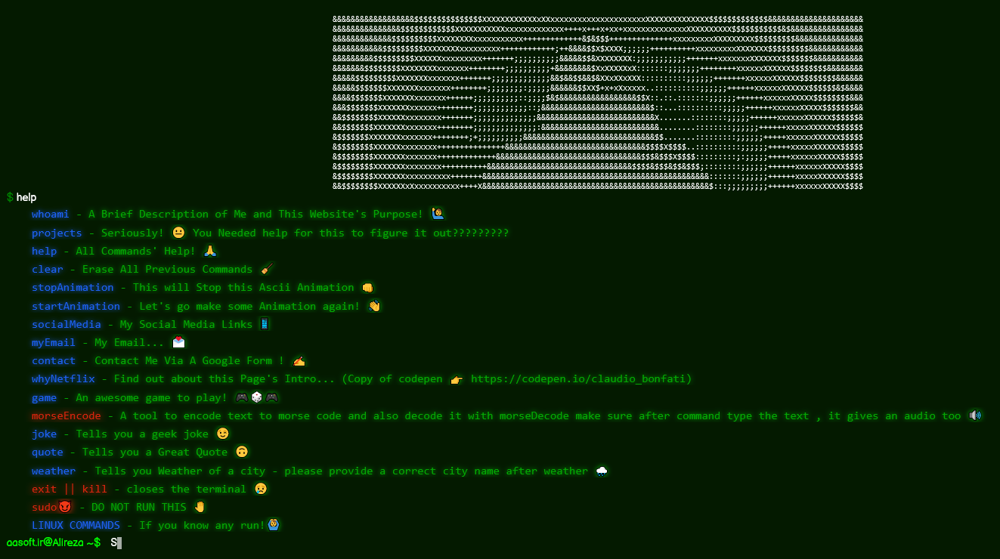

# ⌨️ Terminal-like Website 🌐

Welcome to the **Terminal-like Website** project! This is a fun and interactive website designed to mimic a terminal interface. Built with Vue.js and pure CSS, it offers a sleek and responsive experience.



## 🖥️ Technology Used
## LIVE AT: [Vercel](https://terminal-aasoft.vercel.app)
This project leverages the following technologies:

### - **Vue.js**

### - **Vite**

### - **Pure CSS**

### - **HTML5**

## 🚀 Features

- **Interactive Terminal UI**: Enjoy a realistic terminal interface on your browser.
- **Responsive Design**: Looks great on all devices, thanks to pure CSS.
- **Fast and Lightweight**: Built with Vue.js for a snappy performance.

## 📦 Installation

1. **Clone the repository**:

   ```bash
   git clone https://github.com/AASoftIR/terminal-vuejs.git
   cd terminal-vuejs
   ```

2. **Install dependencies**:

   ```bash
   npm install
   ```

3. **Run the development server**:

   ```bash
   npm run serve
   ```

4. **Open your browser**:
   Navigate to LOCALHOST to see the website in action.

## 📝 License

This project is licensed under the MIT License.\

---

Made with ❤️ by Alireza Mohebbi (https://github.com/AASoftIR)
